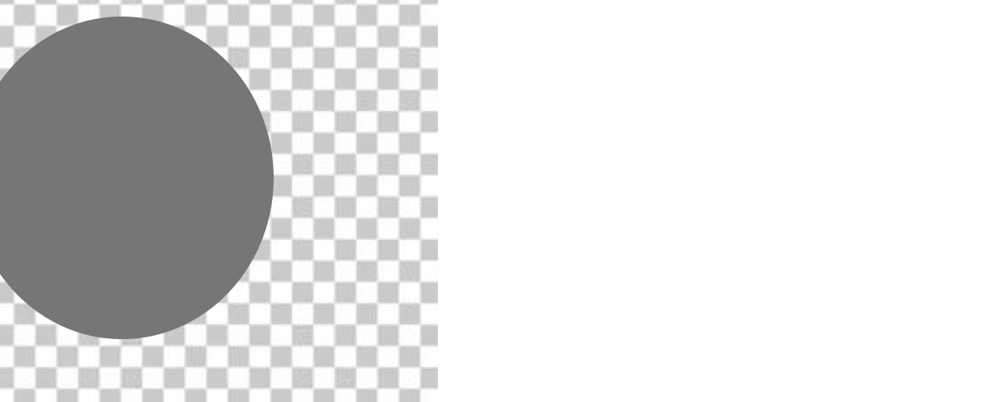

# Vignette Lambda

A generator of fake Youtube thumbnails, just for the fun.

This is a [Next.js](https://nextjs.org) project bootstrapped with [`create-next-app`](https://nextjs.org/docs/app/api-reference/cli/create-next-app).

## Getting Started

Install the packages with `pnpm install`

Then, run the development server with `pnpm dev

Open [http://localhost:3000](http://localhost:3000) with your browser to see the result.

## Add new entries

### Background image

Add your image file to `public/background`, make sure the quality is good and the subject is mainly on top-right of the image.


Then add your entry to the list at `utils/backround.ts` with the name of your entry as a key and the filename as the value.

```typescript
export const background: Record<string, string> = {
    ...
    // One word key
    Example: "example.jpeg",
    // Multiple word key
    "The example": "example.jpeg"
}
```

### Foreground image

Add your image file to `public/foreground`, make sure the quality is good, the subject is mainly on top-left of the image and the background is transparent.



Then add your entry to the list at `utils/foreground.ts` with the name of your entry as a key and the filename as the value. Don't specify the type extension, just make sure your image has `.png` as extension.

```typescript
export const foreground: Record<string, string> = {
    ...
    // One word key
    Example: "example",
    // Multiple word key
    "The example": "example"
}
```

## Learn More

To learn more about Next.js, take a look at the following resources:

- [Next.js Documentation](https://nextjs.org/docs) - learn about Next.js features and API.
- [Learn Next.js](https://nextjs.org/learn) - an interactive Next.js tutorial.

You can check out [the Next.js GitHub repository](https://github.com/vercel/next.js).
